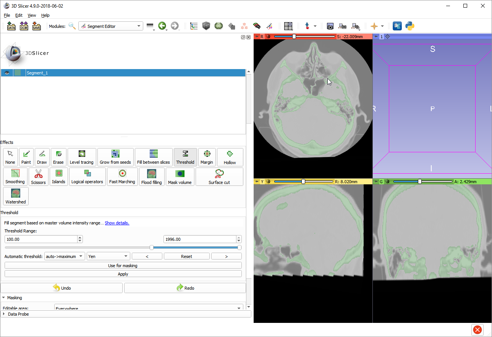
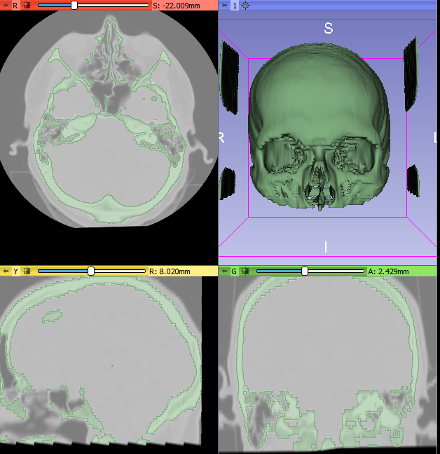
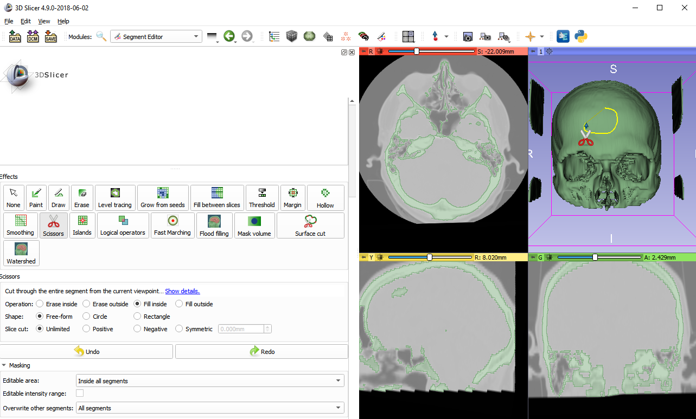
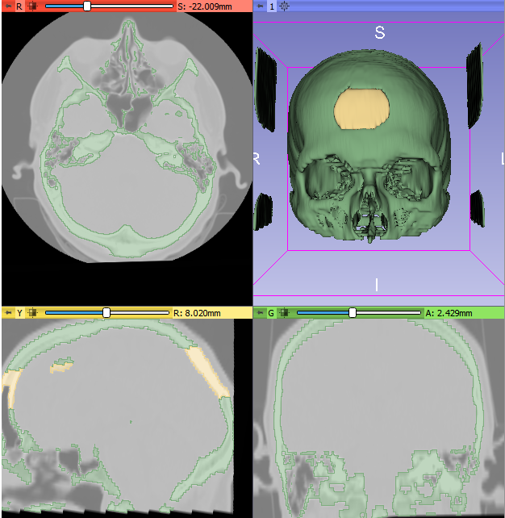
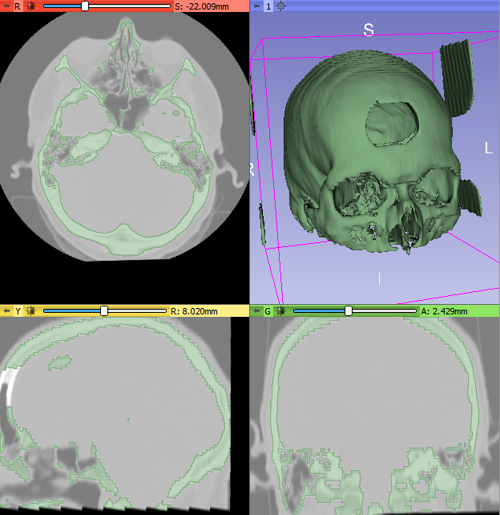
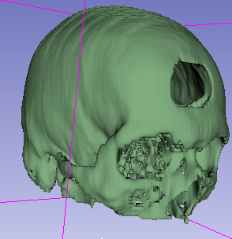

Overview
--------

Task: Cut a hole on the skull to simulate a craniotomy. The same method can be used anytime a segment has to be partitioned to multiple segments.
Imaging modality: any

Prerequisites
-------------

Have a segment that need to cut/partitioned into multiple pieces

Recommended workflow
--------------------

- Create a new segment that will contain the parts separated from the existing segment
- Click `Show 3D` button to see the segment in 3D
- Select `Scissors` effect
- 
 (provided by `SegmentEditorExtraEffects` extension) to segment outside air. Click anywhere in the outside air in slice views to segment the air. If not all areas are hightlighted then click in air regions that are not included and/or increase `Intensity tolerance` parameter. If segment leaks inside the tissue then click `Undo` and increase `Neighborhood size`.
- Use `Logical operators` effect / `Invert` operation to make the segment contain tissue instead of air
- Use `Scissors` effect and `Smoothing` effect to remove artifacts and noise

Example
-------

- Download `CT-MR Brain` sample data set
- Go to `Data` module, select MRBrainT1 and MRBrainT2 data sets, right-click and delete them (we will not use the MRI images)

- Go to `Segment editor` module, click `Add` button to create a new segment
- Select `Threshold` effect, set 100.00 as lower threshold, and click Apply

- Click `Show 3D` button to see the segmented bone in 3D viewer.

- Click `Add` button to create a new segment, which will store the part that is separated from the skull

- Select `Scissors` effect
- Set `Operation` to `Fill inside`, as we will use scissors to fill new empty segment
- Scroll down to `Masking` section and change `Editable area` to `Inside all segments` so that we do not add any new regions to segments, just allow editing within existing segments
 and outline areas in the 3D view that were incorrectly included in the segment (due to image artifacts)
- Mark the boundary of the craniotomy in the 3D view by using the left mouse button

- Press `space` key to deactivate `Scissors` effect
- Click the `eye` icon of `Segment_1` to hide the skull and rotate the 3D view by about 90 degrees. Scissors effect cut through the entire volume, so it created two holes. We will remove the hole on the other side of the skull by adding it to the first segment.
- Select `Segment_1` in the segment list becase we will add back parts from `Segment_2`
- Press `space` key to activate `Scissors` effect
- Draw a curve around the parts of the segment that needs to be added back to the skull.

- Press `space` key to deactivate `Scissors` effect
- Click the `eye` icon of `Segment_1` to show the skull, and click the `eye` icon of `Segment_2` to show the cutout bone

Final result:

