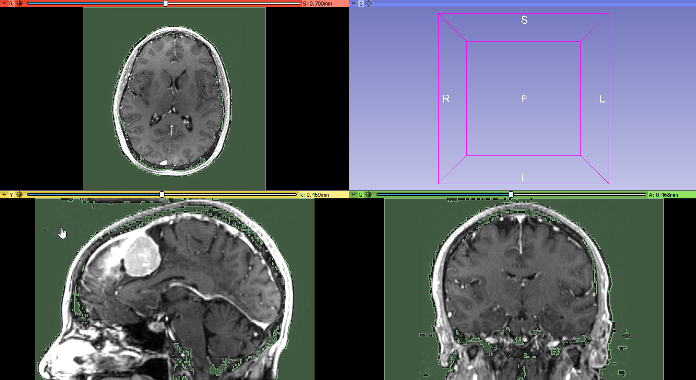
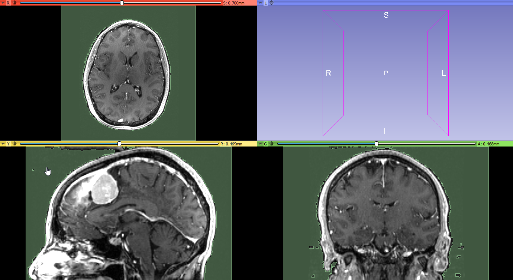
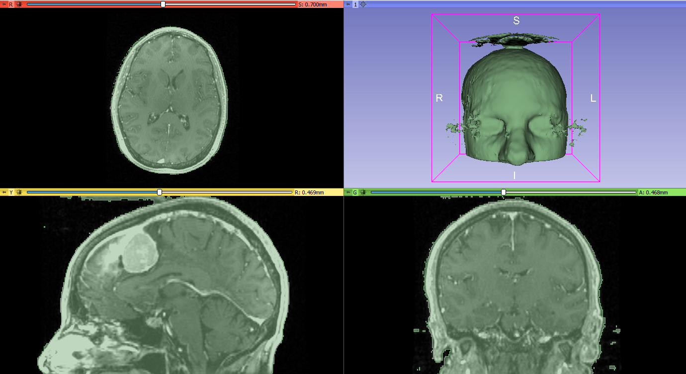
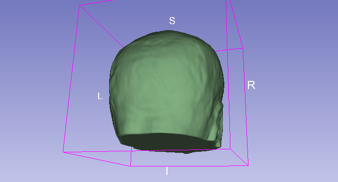

Overview
--------

- Task: Extract skin surface without holes inside the segment. Important for 3D printing or surface-based registration.
- Imaging modality: CT, MRI

**Important: This recipe is now obsolete. It is replaced by a [new recipe that uses `Wrap solifidy` effect](../SkinSurface2/README.md). The new recipe is much simpler and provides comparable or better results as this one.**

Usually there is strong contrast between tissue and air, therefore segmenting the skin surface should be easy, except there may be air inside body part or some tissues or fluids may have image intensity similar to air. Therefore, simple global thresholding may not always work.

Recommended workflow
--------------------

- Use `Flood filling` effect (provided by `SegmentEditorExtraEffects` extension) to segment outside air. Click anywhere in the outside air in slice views to segment the air. If not all areas are hightlighted then click in air regions that are not included and/or increase `Intensity tolerance` parameter. If segment leaks inside the tissue then click `Undo` and increase `Neighborhood size`.
- Use `Logical operators` effect / `Invert` operation to make the segment contain tissue instead of air
- Use `Scissors` effect and `Smoothing` effect to remove artifacts and noise

Example
-------

- Download `MRBrainTumor1` sample data set

- Go to `Segment editor` module, create a new segment
- Select `Flood filling` effect
- Click anywhere in a slice view in air region (outside tissues) => Not all the air region is included in the segment

- Increase `Intensity tolerance` parameter to `20`. Click in air region in a slice view. => Segment leaked inside the tissue.

- Click `Undo` to undo the last flood filling operation.
- Increase `Neighborhood size` to `3.0` to prevent leaking inside tissue. Click in air region in a slice view.

- Select `Logical operators` effect, operation `Invert`, and click `Apply`. Click `Show 3D` to see segmentation result in 3D viewer.

- Select `Scissors` effect and outline areas in the 3D view that were incorrectly included in the segment (due to image artifacts)

- Select `Islands` effect, `Keep largest island` method, click `Apply` to small speckles.

- Select `Smoothing` effect, `Median` smoothing method, click `Apply` to reduce small random noise on the surface boundary.

Final result:

