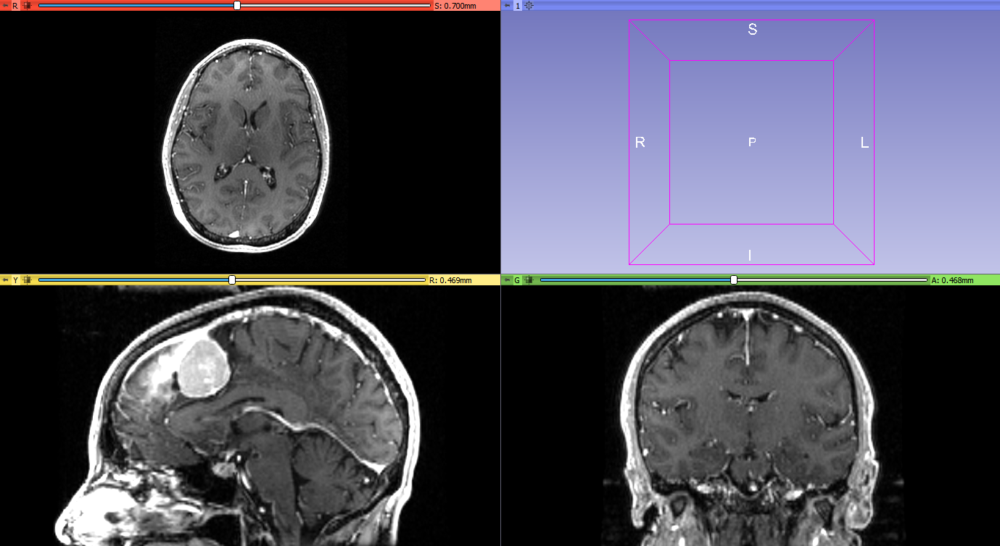
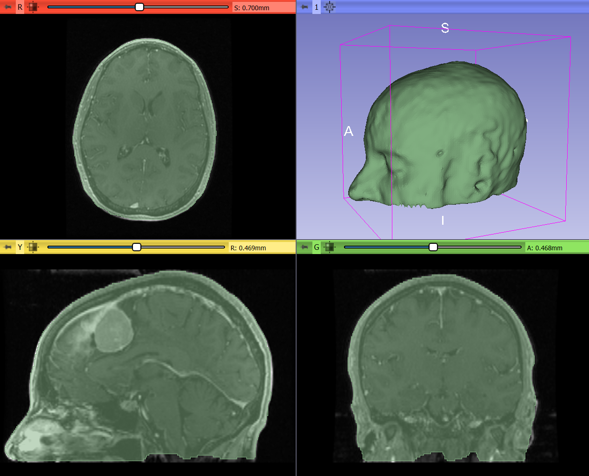

Overview
--------

- Task: Extract skin surface without holes inside the segment. Important for 3D printing or surface-based registration.
- Imaging modality: CT, MRI

Usually there is strong contrast between tissue and air, therefore segmenting the skin surface should be easy, except there may be air inside body part or some tissues or fluids may have image intensity similar to air. Therefore, simple global thresholding may not always work.

This recipe replaces an [earlier recipe that used `Flood filling` effect](../SkinSurface/README.md). This new recipe is much simpler and provides comparable or better results.

Recommended workflow
--------------------

- Use `Threshold` and effect to create a segment that contains the head (skin and internal structures)
- Use `Islands` effect's `Keep largest island` method to remove noise speckles
- Use `Wrap solidify` effect (provided by `SurfaceWrapSolidify` extension) to fill holes inside the segment.

Example
-------

- Download `MRBrainTumor1` sample data set

- Go to `Segment editor` module, create a new segment

- Select `Threshold effect` effect, set range from about 110 to maximum (this selects skin surface and structures inside the head), then click Apply

- Remove small speckles of noise using `Islands` effect: choose `Keep largest island` option and click `Apply`

- Select `Wrap solidify effect`, leave region at default value (`Outer surface`)

- Reduce `Oversampling` value to 0.8x in `Advanced`section for faster computation and smoother surface (optional)

- Click `Apply`

Final result:

